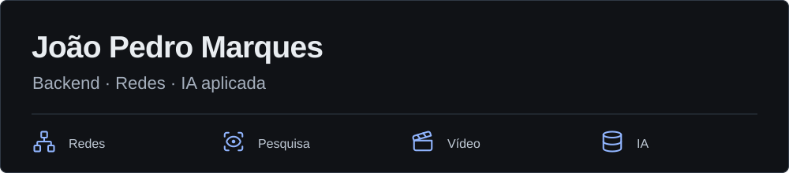

**Desenvolvimento backend, redes e IA aplicada**

Trabalho na Algar com APIs, busca em documentos e monitoria de atendimento. Nos projetos pessoais, exploro transporte de rede, visão computacional e ferramentas locais.

Estudo Ciência da Computação na UFU e desenvolvo pesquisa sobre segmentação de núcleos em imagens microscópicas de *Drosophila melanogaster*.

[Portfólio](https://markesjp.github.io) · [LinkedIn](https://www.linkedin.com/in/jo%C3%A3o-pedro-de-oliveira-marques-78a300253/) · [E-mail](mailto:oliveira.marquesde@gmail.com) · [WhatsApp](https://wa.me/5519991138922)

## Projetos selecionados

### [BugHost](https://markesjp.github.io/projetos/bughost.html)

Projeto colaborativo de orquestração de túneis e cliente Android. Configurações assinadas e revisões monotônicas permitem rejeitar políticas expiradas ou antigas antes de iniciar o transporte.

Python, Kotlin, JNI e C++. A validação Android ponta a ponta está pendente; o estudo de caso registra o estado e as decisões.

### [Segmentação de núcleos](https://github.com/markesjp/projeto_tcc)

Pipeline com análise de contornos, concavidades e cortes geométricos. A avaliação combina correspondência entre instâncias e sobreposição de máscaras para distinguir núcleos separados de uma única massa.

Python, OpenCV e NumPy. Receitas reproduzíveis e comparação com backends opcionais Cellpose e híbridos.

### [LinguaFlow](https://github.com/markesjp/language_ai_app)

Prática de idiomas por texto e voz, com documentos como contexto. Interfaces separadas para conversação, embeddings e reranking permitem trocar provedores locais e em nuvem.

Next.js, FastAPI, PostgreSQL e pgvector. Busca vetorial com fallback por similaridade de cosseno.

### [NoirFlow](https://markesjp.github.io/projetos/noirflow.html)

Estúdio local que coordena roteiro, narração, storyboard e renderização de vídeos. A fila aplica limites separados de CPU, GPU, rede e renderização, com pausa e preservação das etapas concluídas.

TypeScript, React, Fastify, SQLite, Whisper, Remotion e FFmpeg. Código não disponível publicamente; decisões no estudo de caso.

### [Gerenciador de Disco](https://markesjp.github.io/#disk-usage)

Projeto local para analisar armazenamento e revisar duplicatas. O scanner filtra por tamanho, hash parcial e SHA-256; antes da remoção, revalida os arquivos e a cópia que será preservada.

Python e PySide6. Varredura cancelável, limites de diretório e envio à lixeira.

## Experiência

**Algar Tecnologia e Consultoria** · Desenvolvedor Full Stack Júnior desde fevereiro de 2026; estágio de novembro de 2024 a janeiro de 2026.

Atuo nas plataformas IAsmin Knowledge e IAsmin Speech com APIs, busca semântica, RAG e análise de atendimentos, além de integrações com AWS, PostgreSQL e Keycloak.

## Ferramentas

Python, TypeScript, FastAPI, NestJS, Next.js e PostgreSQL. IA e dados: pgvector, LangChain, CrewAI, OpenCV e NumPy. Infraestrutura: Docker, AWS, Redis, Nginx, Keycloak e Git. Monitoramento: Prometheus.

## Antes da conversa, divirta-se um pouco

[Runner](https://markesjp.github.io/?jogo=runner#arcade) · [Invaders](https://markesjp.github.io/?jogo=invaders#arcade) · [Puzzle](https://markesjp.github.io/?jogo=puzzle#arcade) — jogos no portfólio.

## Formação

Ciência da Computação — UFU, conclusão prevista em julho de 2027. Técnico em Informática — IFNMG, 2017–2019.

Português nativo · Inglês intermediário · Espanhol intermediário.
